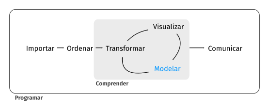

```{r setup, include=FALSE}
knitr::opts_chunk$set(echo = TRUE)
```

<!--
---
#subtitle: "Técnicas para 'Big Data' en Economía"
#subtitle: "Muestreo y Análisis de Datos"
title    :  "Proyecto Final del Curso"
author: 
  - "Prof.: Pedro Albarrán"
job: "Universidad de Alicante" 
date: "Universidad de Alicante, Curso 2021/22"  
output:
  html_document:
    toc: true
    toc_float: true
#  ioslides_presentation: 
#    widescreen: yes
#    logo: pic/by-nc-sa.eu.svg
#  html_document: default
#  beamer_presentation: 
#      slide_level: 2
#widescreen: yes
---
-->

<!--
# Evaluación

La nota final depende de tres componentes:

* Ejercicios prácticos **(P)**  entregados durante el periodo de clases

* Examen final online **(E)**

* Trabajo empírico final **(T)**

Cada uno de estos componentes se evaluará entre 0 y 10. La nota final será la *máxima* de las siguientes dos medias ponderadas:

  (i) $\small 0.30*P + 0.25*E + 0.45*T$
  
  (ii) $\small 0.50*E + 0.50*T$

Por tanto, la nota final también estará entre 0 y 10.

Este cálculo generaliza las dos opciones mencionadas a principio de curso. La nota de quienes opten por la evaluación no continua será la media del examen final (E) y el trabajo empírico (T), dado que será mayor que con la primera opción. Si alguien hubiera entregado estos ejercicios, pero su nota fuera mejor con la segunda opción también sería esa su nota final.

La nota de los ejercicios se calculará como la media de los ejercicios entregados, excluyendo el 20% de notas más bajas. Por ejemplo, con 10 ejercicios entregados, no se incluyen en el cálculo de la media de esta parte las dos notas menores, incluidos los 0 por no entregar. Posteriormente se sumarán hasta dos puntos a esa nota en función de la asistencia y *participación* (respondiendo preguntas en clase).

El examen final se realizará online en la fecha asignada oficialmente y constará de dos partes. La primera será tipo test con preguntas breves de múltiples opciones. La segunda será un examen oral por videoconferencia sobre dos preguntas a desarrollar *brevemente* acerca de los conceptos principales discutidos en el curso. En la web de la asignatura, tenéis disponibles ejemplos de ambas partes. Os daré información sobre la hora concreta, los vínculos para realizar ambas partes y otros detalles más adelante, con suficiente antelación.

Finalmente, el resto de este documento os ofrece información sobre el trabajo empírico final.

-->

# Trabajo empírico final

## Objetivos

Para realizar este proyecto final, debéis proponer un *tema* de estudio usando datos y las técnicas que hemos visto en el curso. Más abajo os indico unas propuestas tanto de temas como de fuentes para obtener datos. También podéis proponerme un tema de estudio, usando datos de que dispongáis por trabajo, contactos, búsqueda propia, etc.
  
En cualquier caso, el resultado final debe ser un proyecto de análisis de datos que tenga sentido en el ámbito de economía, empresa, negocios, finanzas, etc. Se aplicarán los conocimientos adquiridos en el curso, quedando claras todas las etapas del análisis según el conocido flujo

<center>

</center>

Por tanto, debe explicarse claramente:

1. Objetivo del análisis: qué cuestión se analiza y su importancia

2. Datos: qué datos se utilizan, su origen, por qué son adecuados para el objetivo del análisis

3. Procesamiento de los datos (importación, limpieza y transformación): por qué es necesario para el análisis

4. Análisis exploratorio de datos: qué información básica aprendemos de los datos y cómo esto ayuda a especificar los modelos

5. Proceso de Modelización: cómo se especifican distintos modelos que ayudan a responder al objetivo y cómo se validan para obtener el mejor modelo final

6. Comunicar de manera efectiva mediante gráficos, resultados de estimación, etc. las implicaciones de los resultados obtenidos en el análisis para el objetivo. En particular, explicar cómo los resultados responden a la cuestión económica, financiera o decisión de empresa que se plantea cómo objetivo.


## Resultado final

Se debe crear un informe con R Markdown, con un título adecuado, vuestro nombre completo en el campo de autor, etc. Debe incluir secciones y cualquier elemento habitual en un documento que consideréis necesario (listas, imágenes, ...) además del código cuando sea oportuno. Por favor, intentad que el trabajo sea **mínimamente presentable** y profesional; estos años en la Universidad os deben haber proporcionado las capacidades y las herramientas para que vuestro trabajo sea un mini-informe que presentaríais si estuvieseis trabajando. Sin perder excesivo tiempo en una forma perfecta de presentación, no produzcáis un documento con tablas y gráficos difíciles de leer o poco informativos, con una estructura inconexa, etc. No se trata de “amontonar” resultados, sino de presentar una historia que los datos nos cuentas.

Como es habitual, deberéis entregar un archivo .Rmd y un archivo .html (resultado de la compilación del anterior). También se adjuntarán otros archivos que fueran necesarios para REPRODUCIR totalmente el documento o archivos complementarios que consideréis importantes (archivos de datos, archivos de código R complementario, etc.).

Los nombres de los TODOS archivos DEBEN EMPEZAR con vuestro número de DNI (el resto es libre): ej., 

* 12345678_miFinal.Rmd

* 12345678_miFinal.html


## Plazos

* Tan PRONTO como os sea posible, debéis enviarme una propuesta de tema para el proyecto cumplimentando este [FORMULARIO](https://docs.google.com/forms/d/e/1FAIpQLSeXKdPGtTpsXfSh3XZXn3JKN1Q8bx_qMy-Z4w9DQ0IrIPLHHA/viewform). Debéis indicarme qué datos utilizarías, tipo de análisis (regresión, clasificación) y los objetivos/utilidad de hacer ese análisis. Aunque no pondré plazo formal para este paso, os recomiendo que lo hagáis antes del **miércoles, 29 de diciembre de 2021**. Cuanto antes tengáis definido el tema, antes podéis empezar a trabajar.

    + Dos estudiantes diferentes NO pueden hacer el mismo trabajo; los datos pueden ser los mismos, pero NO con el mismo objetivo.
    
    + Antes de comenzar, debéis esperar a que os dé mi visto bueno sobre vuestra propuesta.


* El día asignado oficialmente para el examen de la asignatura haréis una *breve* presentación del estado de vuestro proyecto. Debéis enviar vuestra presentación el día antes en este [formulario](https://docs.google.com/forms/d/e/1FAIpQLSdET7RvNdwAaG4f2nO7_qnhbcymqmUoluybtQ8zQsOEel5X_w/viewform). En esta presentación explicaréis el objetivo del análisis y el estado de vuestro proyecto. En particular, podéis mostrar partes del trabajo ya completadas y presentar esquemáticamente vuestro plan de trabajo previsto. El objetivo de esta presentación NO es evaluar lo que lleváis hecho, sino que os pueda ayudar con comentarios por si tenéis que cambiar, añadir, rectificar, etc. 

* En cualquier momento podéis consultarme dudas relativas al trabajo. Si fuera necesario, en enero podemos tener tanto tutorías presenciales, preferentemente coordinadas entre varios, para poder reservar un aula. <!--En particular, el día reservado para el examen de la asignatura (que no realizamos) sería un momento propicio puesto que ya disponemos de un aula asignada.--> Por favor, avisadme con suficiente antelación.

* El trabajo en su formato final deberá entregarse antes del **miércoles, 2 de febrero de 2022** (hora límite 23:55h de la noche) por medio de este [FORMULARIO](https://docs.google.com/forms/d/e/1FAIpQLSdYMg3LtT4SaxIIMhVt2BDOyZfO2oeY578RPcWO8XYWvCiBIQ/viewform)
  

# Evaluación

En la nota de trabajo se valorará la complejidad de todo el proceso del análisis. No es lo mismo usar unos datos sencillos y ya preparados que  necesitar varias fuentes de datos y combinarlas, usar datos que requieran mucha limpieza o complejos de analizar por el número de observaciones o variables, etc. Asimismo, la profundidad tanto del análisis exploratorio como de los modelos finales y su evaluación se tendrá en cuenta; hacer los más básico visto en clase con unos datos similares a los de clase es válido, pero incluso estando perfecto no podéis esperar la máxima nota.

# IMPORTANTE: plagio

No es la primera vez que estos datos u otros que me propongáis vosotros se han utilizado. Seguro que podéis encontrar análisis ya realizados sobre vuestra propuesta, en internet o de estudiantes de cursos anteriores. Yo también. Probablemente sabéis que la Universidad para una (carísima) licencia para que podamos usar la mejor aplicación de detección de plagio. Yo utilizo adicionalmente otras aplicaciones y algoritmos propios, por ser específicos para detectar variantes de código o porque implementan formas de detección diferentes a las de la aplicación comercial. Por supuesto podéis “colármela” dado que ningún sistema es perfecto (ya sabéis, Falsos Positivos y Falsos Negativos). Evaluad bien las probabilidades y realizad el análisis coste-beneficio con toda la información disponible. Si lo conseguís, enhorabuena. Sabed que la detección de plagio supondrá automáticamente el suspenso en todas las convocatorias de la asignatura en este curso académico y el inicio de la apertura de un expediente.


# Algunas propuestas de temas y fuentes de datos


<!--
(https://www.analyticsvidhya.com/blog/2019/01/big-announcement-your-favourite-hackathons-now-open-for-practice-on-datahack/?utm_source=sendinblue&utm_campaign=Big_Announcement_Hackathons_now_Open&utm_medium=email&utm_source=sendy&utm_medium=datahack&utm_campaign=datahack_practice_announcement)

(https://www.springboard.com/blog/free-public-data-sets-data-science-project/)
-->

<!-- OJO -------------------------------------------------------------------->
<!-- https://data.world/datasets/bike-sharing -->
<!-- PASAR el de loans a ejercicio de ejemplo y buscar otros de loans ------->


1. **Ventas de "Big Mart"**.  Se han recopilado datos de ventas de 1.559 productos para el 2013 en 10 tiendas en diferentes ciudades para la cadena de tiendas americana "Big Mart". Además, se han definido determinados atributos de cada producto y tienda.  El objetivo es construir un modelo predictivo o de clasificación para conocer las ventas de cada producto en una tienda concreta. Con este modelo, se intentará comprender las propiedades de los productos y tiendas que juegan un papel clave en las ventas. Los datos están [aquí](https://drive.google.com/file/d/1Tcr85g-zl_i1XdgAmljcvrB3Dq3_L9d4/view?usp=sharing)
<!--
   (https://www.analyticsvidhya.com/blog/2016/10/17-ultimate-data-science-projects-to-boost-your-knowledge-and-skills/)

   (https://www.analyticsvidhya.com/blog/2016/02/bigmart-sales-solution-top-20/)
   (https://github.com/MichaelPluemacher/Big-Mart-Sales)
   (https://github.com/devarajphukan/BigMart-Sales-Prediction-AnalyticsVidya)

   (https://www.kaggle.com/devashish0507/big-mart-sales-prediction)
-->
<!--
2. **Black Friday**. "ABC Private Limited" quiere comprender el comportamiento de compra para varios productos de diferentes categorías. Se dispone de un resumen de compras de varios clientes y sus datos demográficos. Un modelo para predecir comprar o clasificar compras de gran volumen del cliente ayudará a crear una oferta personalizada para los clientes. Los datos [aquí](https://www.dropbox.com/s/37m2nynxxjzmxta/02black.csv?dl=0)
-->
<!--
   (https://www.analyticsvidhya.com/blog/2016/10/17-ultimate-data-science-projects-to-boost-your-knowledge-and-skills/)
-->

3. **Concesión de préstamos**. "Dream Housing Finance" desea automatizar el proceso de elegibilidad del préstamo a partir de datos del cliente proporcionados al llenar el formulario de solicitud en línea. Para automatizar este proceso, han planteado un problema a la hora de identificar los segmentos de clientes, que son susceptibles de recibir préstamos para poder dirigirse específicamente a estos clientes. Los datos y su descripción [aquí](https://www.dropbox.com/s/5h7g2vped3qpbkk/03loan.zip?dl=0)
<!--
   (https://www.analyticsvidhya.com/blog/2016/10/17-ultimate-data-science-projects-to-boost-your-knowledge-and-skills/)

   (https://rstudio-pubs-static.s3.amazonaws.com/270415_08d6cfdc6a2242f9a4e597e63ceabd69.html)

   (https://rpubs.com/renrele/loanpred)

   (https://rstudio-pubs-static.s3.amazonaws.com/406118_9671536399c843c7a5945e0ab1a42a9d.html)

   (de la version 2, descargado)
   (https://github.com/devarajphukan/Loan-Prediction-AnalyticsVidya)
-->
<!--
    b. Datos de concesión de préstamos de la empresa "Lending club". Información y descarga, previo regristro, [aquí](https://www.lendingclub.com/info/download-data.action)
<!--
   (https://www.springboard.com/blog/free-public-data-sets-data-science-project/)
-->

4. **Clasificación de la calidad crediticia**. Datos de una compañía de tarjetas de crédito alemana, [aquí](https://archive.ics.uci.edu/ml/datasets/Statlog+%28German+Credit+Data%29)
<!--
   (https://www.r-bloggers.com/predicting-creditability-using-logistic-regression-in-r-part-1/)
-->

5. **Servicio de bicicletas**. La empresa "Capital BikeShare" ofrece un servicio de bicicletas compartidas. Quiere saber a dónde van sus usuarios, cuándo viajan, qué paradas son las más populares, en qué días de la semana  se realizan más viajes. Información [aquí](https://www.capitalbikeshare.com/system-data)
<!--
   (https://www.analyticsvidhya.com/blog/2016/10/17-ultimate-data-science-projects-to-boost-your-knowledge-and-skills/)

   (https://www.capitalbikeshare.com/system-data)
   (https://s3.amazonaws.com/capitalbikeshare-data/index.html)
   (https://www.analyticsvidhya.com/blog/2015/06/solution-kaggle-competition-bike-sharing-demand/)
-->
<!-- 
6. **Renta de los individuos**. Con información del Censo de EE.UU. sobre varias características demográficas de una persona, queremos construir un modelo predictivo para determinar su nivel de renta (mayor o menor de 50 mil dólares anuales). El modelo se usará para detectar fraude. Datos [aquí](https://www.dropbox.com/s/vho16xw59qczqpa/06census.zip?dl=0).
<!--
   (https://www.analyticsvidhya.com/blog/2016/10/17-ultimate-data-science-projects-to-boost-your-knowledge-and-skills/)
  
   (https://cloudxlab.com/blog/predicting-income-level-case-study-r/)
   (http://archive.ics.uci.edu/ml/machine-learning-databases/adult/)
  
   (otra fuente de datos similares)
   (http://archive.ics.uci.edu/ml/machine-learning-databases/census-income-mld/census-income.html)
   (http://archive.ics.uci.edu/ml/machine-learning-databases/census-income-mld/census-income.html)
-->

7. **Precios de las casas**

    a. Disponemos de información describiendo (casi) todos los aspectos de las casas residenciales en **Ames, Iowa**, para predecir el precio final de cada casa. Datos y descripción [aquí](https://www.dropbox.com/s/zvvfs88xn8dt4no/07houses.zip?dl=0).
<!--
  [//]: # (https://www.kaggle.com/c/house-prices-advanced-regression-techniques/)
  [//]: # (https://www.r-bloggers.com/kaggles-advanced-regression-competition-predicting-housing-prices-in-ames-iowa/)
-->

    b. Datos extraídos de la *American Community Survey* de 2011 con información sobre el parque de viviendas y las circunstancias económicas de cada área en **California y Pennsylvania**. Datos e información [aquí](https://www.dropbox.com/s/qic1yskj2gurcu3/08calif.zip?dl=0).
<!--
  [//]: # (http://www.stat.cmu.edu/~cshalizi/ADAfaEPoV/ADAfaEPoV.pdf)
  [//]: # (housing <- read.csv("http://www.stat.cmu.edu/~cshalizi/ADAfaEPoV/data/calif_penn_2011.csv"))
-->

    c. Datos se han extraído de los resultados públicos publicados cada semana en <http://domain.com.au> con información sobre precios de las casa en **Melbourne, Australia**. Datos e información [aquí](https://drive.google.com/file/d/1zz8kjIhEGSfKOS6YQOnSOEAoDKivQl0m/view?usp=sharing)
    
9. **Delitos**. 

    a. Datos e información [aquí](https://data.cityofchicago.org/Public-Safety/Crimes-2001-to-present/ijzp-q8t2) sobre los crímenes cometidos en **Chicago** desde 2001. Se puede utilizar para predecir el tipo de crimen, incidencia de crímenes por tipo y zona, etc. Esta información se puede complementar con otras fuentes del mismo portal de datos de Chicago (en particular, datos de socioeconomicos de los vecindarios).

    b. También existe información para Boston [aquí](https://data.boston.gov/dataset/crime-incident-reports-july-2012-august-2015-source-legacy-system) y [aquí](https://data.boston.gov/dataset/crime-incident-reports-august-2015-to-date-source-new-system) y más información en el mismo sitio (p.e., datos socioeconomicos de los vecindarios)
<!--
  [//]: # (https://www.analyticsvidhya.com/blog/2016/10/17-ultimate-data-science-projects-to-boost-your-knowledge-and-skills/)

   [//]: #(https://data.cityofchicago.org/Public-Safety/Crimes-2001-to-present/ijzp-q8t2)
   
   [//]: #(Otros datos de Chicago para combinar)
   [//]: #(https://data.cityofchicago.org/Health-Human-Services/Chicago-poverty-and-crime/fwns-pcmk)
   [//]: #(https://geodacenter.github.io/data-and-lab//comarea_vars/)
-->

10. **Propinas en taxis de NY**. Analizar los determinantes de que la propina sea alta, en función del lugar de origen, destino, etc. Los datos [aquí](https://www.dropbox.com/s/zaptbme1txrhdhi/10taxis.zip?dl=0).
<!--
   [//]: # (https://padamson.github.io/rwml-R/Chapter6.html)
   [//]: # (este son varios gigas, un subset mas manejable en Kaggle)

   [//]: # (https://www.kaggle.com/dhimananubhav/2015-nyc-taxi-trips-subset-12-million-rows/home)

   [//]: # (datos originales, según el pdf, del yellow, no se lo que seran green taxis ni FHV) 
   [//]: # (http://www.nyc.gov/html/tlc/html/about/trip_record_data.shtml)

   [//]: # (dos competiciones de kaggle, con ejemplos resueltos por ahi)
   [//]: # (https://www.kaggle.com/c/new-york-city-taxi-fare-prediction/data)
   [//]: # (https://www.kaggle.com/c/nyc-taxi-trip-duration)
-->


11. **Airbnb**. En este [enlace](http://tomslee.net/airbnb-data-collection-get-the-data) están disponibles conjuntos de datos obtenidos de la web de Airbnb para diferentes ciudades (Alicante no está incluida, pero podéis hacer el "web scraping" si queréis...). Entre otras cosas, se puede analizar los determinantes de la satisfación de los usuarios. Notad que esta fuente da para varios trabajos, tanto por usar distintas ciudades (cuidado con trabajos "demasiado" similares) como porque, como con otros datos, se pueden analizar más de una cosa.
<!--
  [//]: # (https://www.springboard.com/blog/free-public-data-sets-data-science-project/)
-->

12. **Precio de las acciones**. Usando información sobre fundamentales de las acciones, se puede predecir el valor o determinar (clasificar) si están sobrevaloradas o infravaloradas. Podéis utilizar [estos datos](http://www.usfundamentals.com/download/) o buscar vuestros propios datos de otras empresas (por ejemplo, españolas).
<!--
  [//]: # (https://elitedatascience.com/machine-learning-projects-for-beginners)
  [//]: # (http://www.usfundamentals.com/download/)
-->

13. **Predicción de Respuesta del Cliente** y maximización de beneficios. Datos de una campaña de "mailing" directo a clientes con información sobre características demográficas de los clientes y su historial. El objetivo es predecir la respuesta de los clientes en caso de ser contactados para fines de donación. Al clasificar a los clientes, se puede maximizar el importe de la donación. Datos y descripción [aquí](https://www.dropbox.com/s/9hfftmdbgrerv6h/13respuesta.zip?dl=0).
<!--
  [//]: # (r data mining libro descargado con datos de KDD CUP: https://kdd.ics.uci.edu/databases/kddcup98/kddcup98.html)
-->
<!--  
14. **Stock pairs** es un estrategia de "trading" desarrollada por "Morgan Stanley" en los años 1980 (ver [aquí](https://en.wikipedia.org/wiki/Pairs_trade)). Si dos precios de acciones o índices bursátiles como Dow Jones y S&P 500 están históricamente correlados, la ratio de precios tiene un valor estable. Si la ratio de precio se desvía significativamente de ese valor indica que una está infravalorada y deberá subir. El objetivo es desarrollar un modelo que prediga una subida en función de valores pasados de la ratio. Se podrían utilizar dos series de precios de acciones cualquiera, PERO este trabajo es más complejo de lo que parece: se requiere información adicional de fundamentales, una modelización ARIMA apropiada, etc. Consultad conmigo ANTES de elegir esto.
<!--
  [//]: # (http://rdatasciencecases.org/Data.html)
  [//]: # (data-science-in-r.pdf descargado)
-->

15. [Este paquete](https://github.com/datawookie/trundler) de R  acceso a los datos de productos y precios históricos de una serie de minoristas en línea.

16. [Este conjunto de datos](https://www.kaggle.com/aungpyaeap/supermarket-sales) contiene información sobre las ventas históricas de una compañía de supermercados.

<!--
17. Se pueden utilizar encuestas oficiales para **predecir la pobreza** de los hogares. Si os interesa, preguntadme.
-->

<!--
Se pueden encontrar otras fuentes con información sobre datos en Internet. Por ejemplos, distintas organizaciones y empresas celebran "hackatones" de análisis de datos y aprendizaje automático; por ejemplo, [aquí](https://www.zaratalent.com/data.html).
<!--y [aquí](https://hackathonspain.com/calendario/hackathon-inditex/)), BBVA (entre otros, [aquí](https://openinnovation.bbva.com/es/evento/hackathon-bbva-2020) y [aquí]())

  * 
  
  * https://openinnovation.bbva.com/es/evento/hackathon-bbva-2020
-->


Otras fuentes generales son:

  * https://www.kaggle.com/datasets
  
  * https://github.com/caesar0301/awesome-public-datasets
  
  * https://www.kdnuggets.com/datasets/index.html
  
  * https://github.com/rfordatascience/tidytuesday
  
  * https://www.data.gov/
  
  * https://data.worldbank.org/
  
  * https://github.com/fivethirtyeight/data
  
  * https://aws.amazon.com/datasets/
  
  * https://cloud.google.com/bigquery/public-data/
  
  * https://www.quandl.com/

<!--
  * https://www.gapminder.org/data/  
  
  [//]: # (https://www.analyticsvidhya.com/blog/2016/11/25-websites-to-find-datasets-for-data-science-projects/)

  [//]: # (https://www.springboard.com/blog/free-public-data-sets-data-science-project/)

  [//]: # (http://research.pomona.edu/johardin/datasources/)
-->